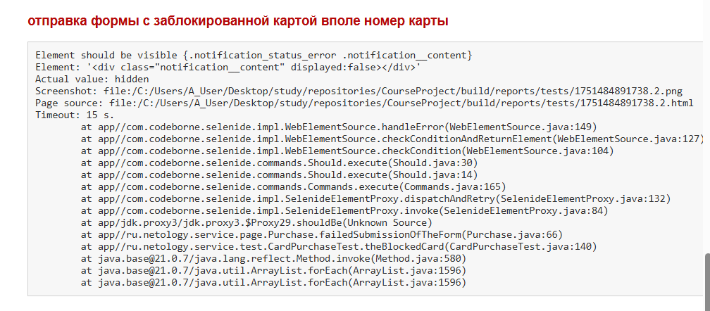
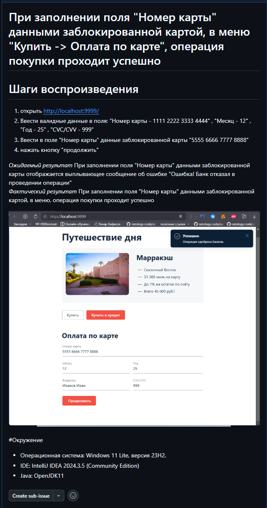
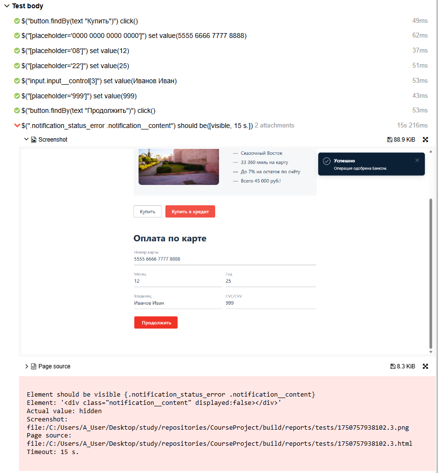

## Описание
Проведено функциональное тестирование веб-приложения AQA Shop, предназначенного для оформления туров с оплатой через банковскую карту или кредит.
Тестирование охватывает UI, API и взаимодействие с базами данных (PostgreSQL и MySQL). Приложение развернуто в двух конфигурациях — с MySQL и PostgreSQL.

## Колличество тест-кейсов
- Всего: 31 тест-кейс
- Успешно пройдены: 27 (87.09%)
- Провалено: 4 (12.91%)
  * https://github.com/AsjaMedved/CourseProject/issues/1

  * https://github.com/AsjaMedved/CourseProject/issues/3
  
  
  
## Общие рекомендации
- Улучшить валидацию поля "Владелец" для предотвращения отправки некорректных данных.
- Улучшить валидацию поля "Номер карты" для предотвращения отправки некорректных данных.

## Интеграция отчётов
Отчёт Allure: сгенерирован командой ./gradlew allureServe и доступен в: 
- build/allure-report/index.html

- Отчёт Gradle  
- build/reports/tests/test/index.html

