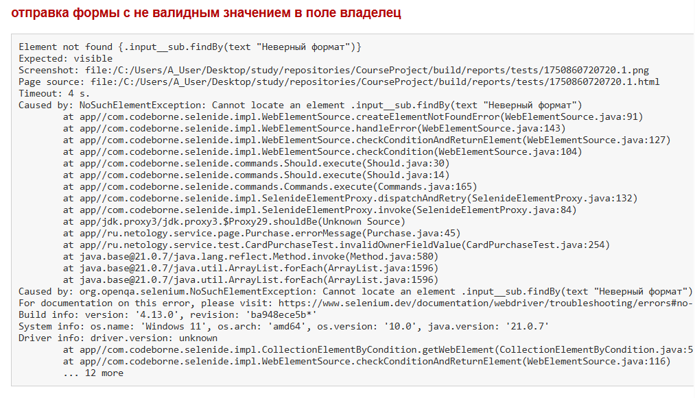
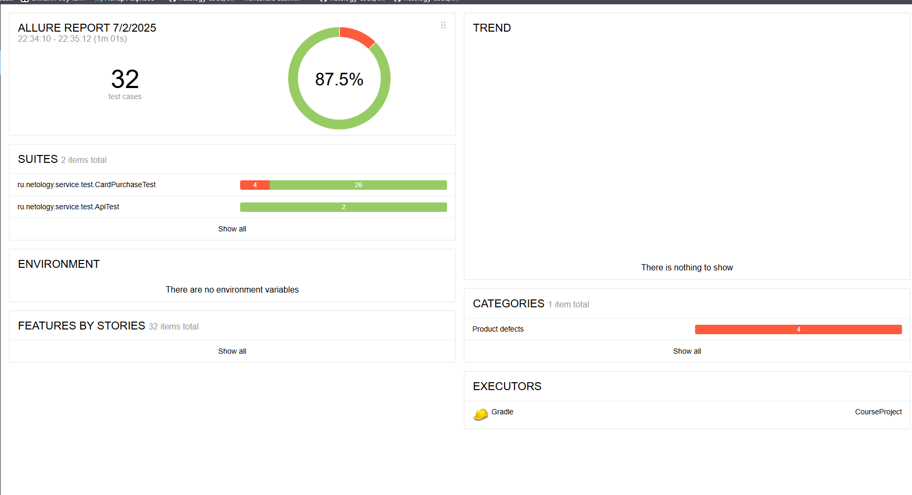

## Описание
Проведено функциональное тестирование веб-приложения AQA Shop, предназначенного для оформления туров с оплатой через банковскую карту или кредит.
Цель — проверить корректность работы формы оплаты, включая валидацию данных, запись в БД, корректность статусов транзакций.

Тестирование включало:
- UI-тесты формы оплаты
- API-тесты отправки данных
- Генерацию отчётов Allure
- Регистрацию багов через issues в GitHub

## Колличество тест-кейсов
- Всего: 32 тест-кейсов
- Успешно пройдены: 28 тестов (87%)
- Провалено: 4 теста (13%)

## Общие рекомендации
- Исправить баг, связанный с неверной валидацией поля "Владелец" — при заполнении невалидными значениями операция покупки проходит успешно (см. [issue #1](https://github.com/AsjaMedved/CourseProject/issues/1)) и (см. [issue #2](https://github.com/AsjaMedved/CourseProject/issues/2))
- Исправить баг, связанный с не верной валидацие поля "Номер карты" - при заполнении данными заблокированной карты операция покупки проходит успешно (см. [issue #3](https://github.com/AsjaMedved/CourseProject/issues/3)) и (см. [issue #4](https://github.com/AsjaMedved/CourseProject/issues/4))
- 
## Интеграция отчётов
**Отчёт Allure**
* сгенерирован командой:
  * ./gradlew allureServe 
* доступен по адресу:
  * build/allure-report/index.html

**Отчёт Gradle**
* Сгенерирован командой:
  * .\gradlew test "-Dspring.profiles.active=mysql" - для MySQL 
  * .\gradlew test "-Dspring.profiles.active=postgres" - для PostgreSQL
* Доступен по адресу:
  * build/reports/tests/test/index.html

## Примеры багов
* При заполнении поля "Владелец" не валидными значениями, операция покупки проходит успешно
  * (см. [issue #1](https://github.com/AsjaMedved/CourseProject/issues/1)) 
  * (см. [issue #2](https://github.com/AsjaMedved/CourseProject/issues/2))

* При заполнении поля "номер карты" данными заблокированной карты, оперция проходит успешно 
  * (см. [issue #3](https://github.com/AsjaMedved/CourseProject/issues/3)) 
  * (см. [issue #4](https://github.com/AsjaMedved/CourseProject/issues/4))
  
  

